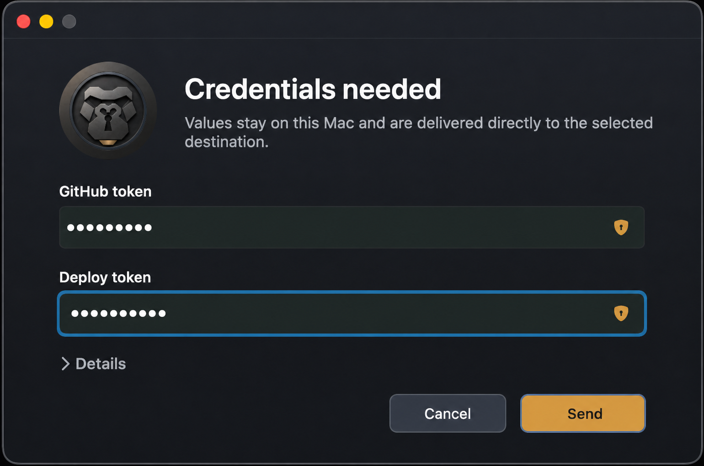

<p align="center">
  
</p>

# KeyKong
Key Kong collects user values in a native macOS prompt, delivers them to
visible local destinations, and keeps secrets out of model context, logs, and
tool responses.

## Usage

Install Key Kong locally:

```sh
bun run install:local
```

Add the agent skill:

```sh
npx skills add . --skill keykong
```

## Development

Install dependencies and run both test suites:

```sh
bun install
```

Run the built CLI with a representative prompt for visual testing:

```sh
bun test:ui -b
```
